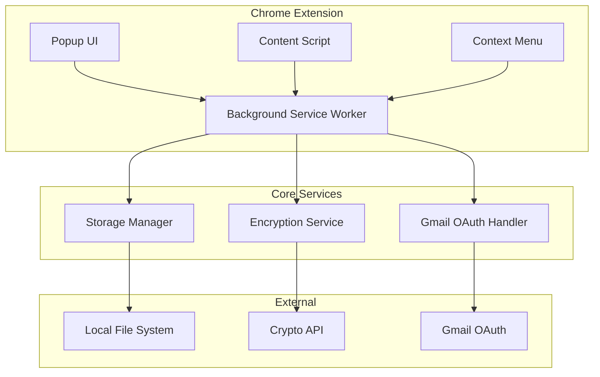

# Design Document

## Overview

The Chrome Password Manager extension will be built using Manifest V3 architecture with a focus on security, local storage, and seamless user experience. The extension will consist of multiple components working together: a popup interface, content scripts for web page interaction, background service worker for core logic, and a robust encryption system for data protection.

## Architecture

### High-Level Architecture



### Component Breakdown

1. **Popup Interface**: Main UI for credential management, login, and settings
2. **Content Script**: Injected into web pages for form detection and autofill
3. **Background Service Worker**: Core business logic and API handling
4. **Context Menu Handler**: Right-click menu integration
5. **Storage Manager**: Local file operations and data persistence
6. **Encryption Service**: AES encryption/decryption using Web Crypto API
7. **OAuth Handler**: Gmail authentication management

## Components and Interfaces

### 1. Popup Interface (`popup.html`, `popup.js`, `popup.css`)

**Responsibilities:**
- User authentication (login/signup)
- Credential management (add, view, edit, delete)
- Import/export operations
- Settings and key phrase management

**Key Interfaces:**
```typescript
interface PopupController {
  handleLogin(gmailToken: string, masterPassword: string): Promise<boolean>
  handleSignup(gmailToken: string, masterPassword: string): Promise<string[]> // Returns key phrase
  addCredential(url: string, username: string, password: string): Promise<void>
  viewCredentials(): Promise<DecryptedCredential[]>
  exportData(keyPhrase: string[]): Promise<Blob>
  importData(file: File, keyPhrase: string[]): Promise<void>
}
```

### 2. Background Service Worker (`background.js`)

**Responsibilities:**
- Central message routing between components
- OAuth token management
- Encryption/decryption coordination
- Context menu registration
- Storage operations

**Key Interfaces:**
```typescript
interface BackgroundService {
  handleMessage(message: ExtensionMessage): Promise<any>
  initializeContextMenus(): void
  handleOAuthCallback(token: string): Promise<void>
  encryptAndStore(data: CredentialData): Promise<void>
  decryptAndRetrieve(): Promise<CredentialData>
}
```

### 3. Content Script (`content.js`)

**Responsibilities:**
- Form field detection and extraction
- Automatic form filling
- Communication with background script

**Key Interfaces:**
```typescript
interface ContentScript {
  detectLoginFields(): LoginFieldInfo | null
  extractCredentials(): { username: string, password: string } | null
  fillCredentials(username: string, password: string): void
  setupFormListeners(): void
}
```

### 4. Storage Manager (`storage.js`)

**Responsibilities:**
- Local file system operations
- Data serialization/deserialization
- File import/export handling

**Key Interfaces:**
```typescript
interface StorageManager {
  saveEncryptedData(encryptedData: string): Promise<void>
  loadEncryptedData(): Promise<string | null>
  exportToFile(data: string, filename: string): Promise<void>
  importFromFile(file: File): Promise<string>
}
```

### 5. Encryption Service (`crypto.js`)

**Responsibilities:**
- AES-256-GCM encryption/decryption
- Key derivation from master password
- Secure key phrase handling

**Key Interfaces:**
```typescript
interface EncryptionService {
  deriveKey(password: string, salt: Uint8Array): Promise<CryptoKey>
  encrypt(data: string, key: CryptoKey): Promise<EncryptedData>
  decrypt(encryptedData: EncryptedData, key: CryptoKey): Promise<string>
  generateKeyPhrase(): string[]
  encryptWithKeyPhrase(data: string, keyPhrase: string[]): Promise<string>
  decryptWithKeyPhrase(encryptedData: string, keyPhrase: string[]): Promise<string>
}
```

## Data Models

### Core Data Structures

```typescript
interface Credential {
  id: string
  url: string
  username: string
  password: string
  createdAt: Date
  updatedAt: Date
}

interface UserProfile {
  gmailId: string
  encryptedCredentials: string
  keyPhraseSalt: string
  createdAt: Date
}

interface EncryptedData {
  data: string
  iv: Uint8Array
  salt: Uint8Array
}

interface ExtensionMessage {
  type: 'SAVE_CREDENTIAL' | 'GET_CREDENTIALS' | 'AUTOFILL' | 'LOGIN' | 'EXPORT' | 'IMPORT'
  payload: any
}
```

### Storage Schema

```json
{
  "userProfile": {
    "gmailId": "user@gmail.com",
    "keyPhraseSalt": "base64-encoded-salt",
    "createdAt": "2024-01-01T00:00:00Z"
  },
  "encryptedCredentials": "base64-encoded-encrypted-data",
  "version": "1.0.0"
}
```

## Error Handling

### Error Categories and Handling

1. **Authentication Errors**
   - Gmail OAuth failures: Retry mechanism with user notification
   - Invalid master password: Clear error message with retry option
   - Session expiration: Automatic re-authentication prompt

2. **Encryption Errors**
   - Key derivation failures: Fallback to re-authentication
   - Decryption failures: Data corruption warning and recovery options
   - Invalid key phrase: Clear error message for import/export

3. **Storage Errors**
   - File system access denied: Permission request with fallback
   - Corrupted data: Backup restoration options
   - Import/export failures: Detailed error messages with troubleshooting

4. **Network Errors**
   - OAuth connectivity issues: Offline mode notification
   - Service unavailable: Graceful degradation to local operations

### Error Recovery Strategies

```typescript
interface ErrorHandler {
  handleAuthError(error: AuthError): Promise<void>
  handleEncryptionError(error: CryptoError): Promise<void>
  handleStorageError(error: StorageError): Promise<void>
  showUserError(message: string, recoveryOptions?: string[]): void
}
```

## Security Considerations

### Encryption Strategy
- **Master Password**: Used as primary encryption key via PBKDF2 key derivation
- **Key Phrase**: 16-word BIP39-style phrase for import/export encryption
- **Algorithm**: AES-256-GCM for authenticated encryption
- **Salt**: Unique salt per user for key derivation
- **IV**: Unique initialization vector per encryption operation

### Security Measures
1. **Memory Management**: Clear sensitive data from memory after use
2. **Content Security Policy**: Strict CSP to prevent XSS attacks
3. **Permissions**: Minimal required permissions in manifest
4. **Input Validation**: Sanitize all user inputs and file imports
5. **Secure Communication**: All internal messages use structured validation

### Data Protection
- No credentials stored in plain text
- Master password never stored, only used for key derivation
- Key phrase required for data portability
- Local storage only, no cloud synchronization

## Testing Strategy

### Unit Testing
- **Encryption Service**: Test all crypto operations with known vectors
- **Storage Manager**: Mock file system operations
- **Content Script**: Test form detection and filling logic
- **Background Service**: Test message routing and state management

### Integration Testing
- **End-to-End Flows**: Complete user journeys from signup to credential use
- **Cross-Component Communication**: Message passing between all components
- **Error Scenarios**: Test all error conditions and recovery paths

### Security Testing
- **Encryption Validation**: Verify encrypted data cannot be decrypted without proper keys
- **Input Sanitization**: Test against malicious inputs and XSS attempts
- **Permission Boundaries**: Ensure extension operates within declared permissions

### Browser Testing
- **Chrome Compatibility**: Test across different Chrome versions
- **Performance**: Memory usage and response time benchmarks
- **Manifest V3 Compliance**: Ensure all APIs used are Manifest V3 compatible

### Test Data Management
```typescript
interface TestDataManager {
  generateTestCredentials(): Credential[]
  createMockUserProfile(): UserProfile
  generateTestKeyPhrase(): string[]
  createEncryptedTestData(): string
}
```

## Implementation Notes

### Chrome Extension Manifest V3 Requirements
- Service worker instead of background pages
- Declarative content scripts
- Action API for popup
- Storage API for local data
- Identity API for OAuth

### Performance Considerations
- Lazy loading of encryption operations
- Efficient credential search and filtering
- Minimal memory footprint for content scripts
- Optimized popup load times

### User Experience
- Progressive disclosure of advanced features
- Clear visual feedback for all operations
- Accessible design following WCAG guidelines
- Intuitive right-click context integration