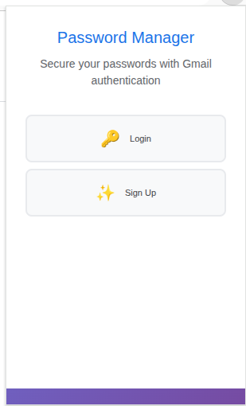
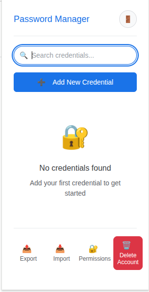
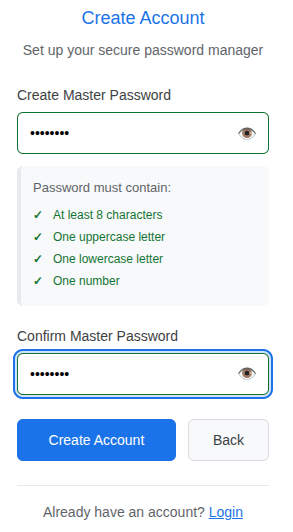
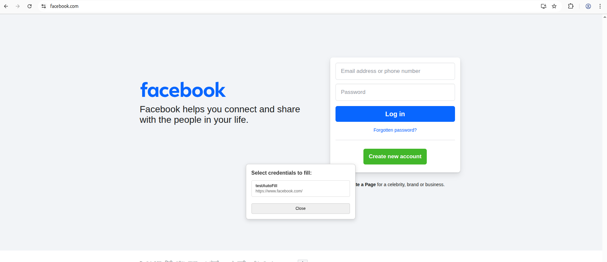
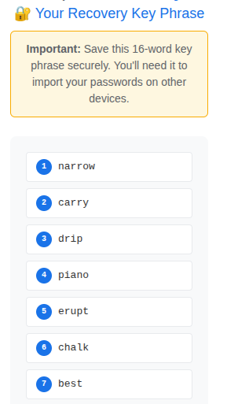
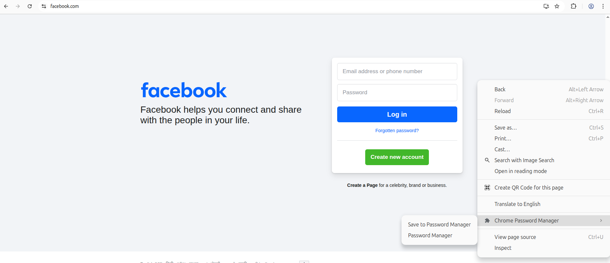

# Chrome Password Manager

A **local-only** Chrome extension (Manifest V3) for storing credentials with a master password and AES-256-GCM encryption. Nothing is synced to the cloud.

Write-up: [From idea to production — building this extension with AI-assisted development](https://medium.com/@ratneshchandak/from-idea-to-production-creating-a-chrome-password-manager-using-kiros-ai-vibe-coding-3ad991cac134)

## Features

- Master password signup/login with session timeout and logout
- AES-256-GCM storage; PBKDF2 key derivation from master password
- 16-word BIP39-style recovery phrase for encrypted export/import
- Dashboard: add, edit, search, view, and copy credentials (re-auth with master password)
- Context menu: save credentials from any page; autofill on matching sites
- Import/export encrypted JSON; account delete and permission management
- Optional Gmail OAuth client ID in `manifest.json` (configure for your project)

## Project layout

```
├── manifest.json
├── src/
│   ├── popup/          # UI (HTML, CSS, JS)
│   ├── background/     # Service worker & message routing
│   └── content/        # Form detection & autofill
├── icons/              # 16, 32, 48, 128px
└── images/             # Screenshots
```

## Run locally

1. Clone this repository.
2. Add your Gmail OAuth client ID to `manifest.json` if you use Google sign-in.
3. Open `chrome://extensions/` → enable **Developer mode** → **Load unpacked** → select this folder.

## Security model

| Layer | Approach |
|-------|----------|
| At rest | AES-256-GCM |
| Master password | PBKDF2-derived keys |
| Export/import | Recovery phrase encrypts JSON payloads |
| Network | No remote credential storage |

## Screenshots

| | |
|---|---|
|  |  |
|  |  |
|  |  |

More UI samples are in [`images/`](./images/).

## License

See repository license file. Use at your own risk for personal credential management; review security before production use.
