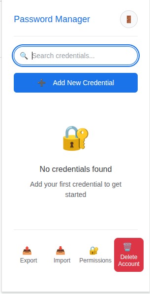

# Chrome Password Manager Extension

A secure local password manager Chrome extension with authentication and encrypted storage. [The link to medium article](https://medium.com/@ratneshchandak/from-idea-to-production-creating-a-chrome-password-manager-using-kiros-ai-vibe-coding-3ad991cac134): 

## Project Structure

```
├── manifest.json                 # Chrome extension manifest (Manifest V3)
├── src/
│   ├── popup/                   # Extension popup interface
│   │   ├── popup.html          # Main popup HTML
│   │   ├── popup.css           # Popup styling
│   │   └── popup.js            # Popup logic and UI interactions
│   ├── background/              # Background service worker
│   │   └── background.js       # Core business logic and message routing
│   └── content/                 # Content scripts for web page interaction
│       └── content.js          # Form detection and autofill functionality
├── icons/                       # Extension icons (16, 32, 48, 128px)
└── README.md                    # This file
```

## Features

- Master password protection
- Local encrypted storage
- Right-click context menu integration
- Automatic form detection and filling
- Import/export with key phrase encryption
- Offline functionality

## Development Setup

1. Clone this repository
2. Add your Gmail OAuth client ID to `manifest.json`
3. Create icon files in the `icons/` directory
4. Load the extension in Chrome:
   - Open Chrome and go to `chrome://extensions/`
   - Enable "Developer mode"
   - Click "Load unpacked" and select this directory

## Security Features

- AES-256-GCM encryption for all stored data
- PBKDF2 key derivation from master password
- 16-word BIP39-style key phrases for import/export
- No cloud storage - all data stays local
- Secure memory management to prevent data leaks

## Requirements Covered

This basic structure addresses all requirements by providing:
 - Create Account/signup using Master Password
 - 16-word Engligh key phrase geerator using BIP39 word list at time of signup (Needed for import/export of credentials)
 - Login using master password
 - Manual addition of new credentials, user input: website, username and password and saving done by re-authentication with master password.
 - Updating/Editing existing credentials by re-authenticating with master password
 - Copying/retrieving existing saved password by re-authenticating with master password.
 - Viewing existing saved password by re-authenticating with master password.
 - Searching exisitng creds in the search bar.
 - Exporting encrypted credentials in .json file by entering the 16-word English key phrase(generated at time of signup)
 - Session management and timeout. 
 - Manual Logout option and auto-logout on browser closer or timeout and with proper cleanup
 - Account Delete option.
 - Manage permissions option to enable scripting and activeTab permission
 - Autofill username and password in existing url from saved credentials from password manager. 
 - Save creds to password manager by right click menu context. 
 - Importing .json encrypted credentials file.

## Next Steps

The basic project structure is now complete. The next tasks will implement:
1. Import Functionality.
2. UI functionality and aesthetic improvement.
3. Bug Fixes.

## Sample UI Images





